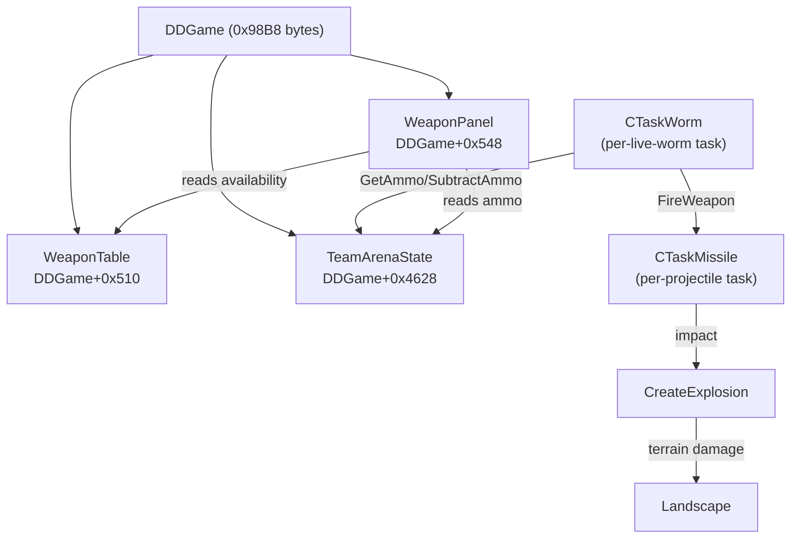
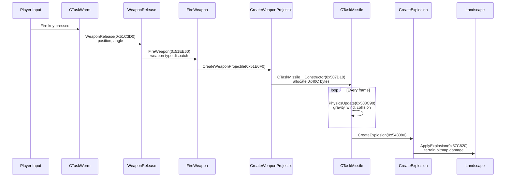

# Weapon System

Comprehensive reference for the Worms Armageddon 3.8.1 weapon system internals.

## Overview

The weapon system spans multiple subsystems: a **weapon table** defining all 71 weapons, an **ammo/delay tracker** per team/alliance, a **firing dispatch** that routes weapon activation to type-specific handlers, **CTaskMissile** objects for in-flight projectiles, and an **explosion system** for terrain damage.

### Object Relationships



### Firing Sequence



## WeaponEntry & WeaponTable

### WeaponTable (DDGame+0x510)

Allocated by `InitWeaponTable` (0x53CAB0, stdcall(wrapper), RET 0x4). Called once
during `CTaskGameState__vmethod_7` at game start.

```
+0x00   [WeaponEntry; 71]   entries     Standard weapons (0..70)
Total:  71 × 0x1D0 = 0x80B0 bytes (no header)
```

### WeaponEntry (0x1D0 = 464 bytes per entry)

Source: `wkJellyWorm/src/CustomWeapons.h` (WeaponStruct) + InitWeaponTable analysis.

```
+0x00   *const c_char   name1           Primary weapon name string
+0x04   *const c_char   name2           Secondary weapon name string
+0x08   i32             panel_state     Panel state (init: 0xFFFFFFFF). wkJellyWorm: panelRow
+0x0C   i32             unknown_0c      Unknown
+0x10   i32             defined         Nonzero = weapon exists. Checked by CheckWeaponAvail.
+0x14   [u8; 0x10]      unknown_14      Unknown
+0x24   i32             availability    Init: 0xFFFFFFFF, then 0 or 1. None/SkipGo/Surrender = 0.
+0x28   i32             enabled         Init: 1
+0x2C   [u8; 0x1A4]     unknown_2c      Remaining fields (opaque)
```

**InitWeaponTable per-entry initialization:**

- +0x08 = 0xFFFFFFFF (panel_state)
- +0x24 = 0xFFFFFFFF (availability, then overwritten per-weapon)
- +0x28 = 1 (enabled)
- Weapon 0 (None), 57 (SkipGo), 58 (Surrender): availability forced to 0

**Rust types:** `WeaponEntry`, `WeaponTable` in `openwa-game/src/game/weapon.rs`.

### Weapon Enum (71 entries)

Defined in `openwa-game/src/game/weapon.rs`. Key weapon IDs:

| ID  | Hex  | Name           | Category                         |
| --- | ---- | -------------- | -------------------------------- |
| 0   | 0x00 | None           | -                                |
| 1   | 0x01 | Bazooka        | Projectile                       |
| 2   | 0x02 | HomingMissile  | Projectile (homing)              |
| 6   | 0x06 | Grenade        | Thrown                           |
| 10  | 0x0A | Earthquake     | Special (net-disabled)           |
| 24  | 0x18 | SuperSheep     | Animal (restricted)              |
| 25  | 0x19 | AquaSheep      | Animal (restricted)              |
| 37  | 0x25 | NinjaRope      | Rope                             |
| 40  | 0x28 | Teleport       | Utility (immune to sudden death) |
| 54  | 0x36 | Donkey         | Special (disable flag)           |
| 55  | 0x37 | NuclearTest    | Special (net-disabled)           |
| 56  | 0x38 | Armageddon     | Special (net-disabled)           |
| 59  | 0x3B | SelectWorm     | Action (needs >1 alive worm)     |
| 66  | 0x42 | Invisibility   | Power-up (mode flag)             |
| 69  | 0x45 | DoubleTurnTime | Power-up (threshold)             |

## Ammunition & Delay System

### Storage: TeamArenaState (DDGame+0x4628)

Ammo and delay are stored in a flat array indexed by alliance and weapon ID.

```
Flat index = alliance_id × 142 + weapon_id

Ammo:  TeamArenaState + 0x1EB4 + flat_index × 4
Delay: TeamArenaState + 0x1EB4 + (flat_index + 71) × 4

Values: -1 = unlimited, 0 = none, >0 = count
Delay:  0 = available, >0 = turns until available
```

6 alliances × 142 entries (71 ammo + 71 delay) = 852 total slots.

Alliance ID is read from the team's sentinel worm field at offset +0x80
(`sentinel_weapon_alliance`).

### Functions

| Function        | Address  | Convention | Parameters                                                  |
| --------------- | -------- | ---------- | ----------------------------------------------------------- |
| GetAmmo         | 0x5225E0 | usercall   | EAX=team_index, ESI=arena_base, EDX=weapon_id → EAX=ammo    |
| AddAmmo         | 0x522640 | usercall   | EAX=team_index, EDX=amount, stack(base, weapon_id), RET 0x8 |
| SubtractAmmo    | 0x522680 | usercall   | EAX=team_index, ECX=arena_base, stack(weapon_id), RET 0x4   |
| SubtractAmmo_v2 | 0x558E80 | fastcall   | ECX=param1, EDX=CTaskTeam\*                                 |
| CountAliveWorms | 0x5225A0 | usercall   | EAX=team_index, ECX=arena_base → EAX=count                  |

**GetAmmo special rules:**

- Returns 0 if weapon delay > 0 (weapon on cooldown)
- Sudden death (game_phase ≥ 484): returns 0 for all except Teleport (0x28)
- SelectWorm (0x3B): returns 0 if team has ≤1 alive worm
- Game mode flag at TeamArenaState+0x2C0C can override delay checks

**SubtractAmmo call sites (verified):**

- `CTaskWorm__HandleMessage` (0x512C27): subtracts Teleport (0x28) ammo
- `CTaskTeam_vt2__vmethod_2` (0x558443): subtracts the team's selected weapon
- `FUN_0055f8c0` (3 sites): subtracts DamageX2 (0x43), CrateSpy (0x44), and others

Our hook reportedly never triggered — this was because the test replay (bots)
doesn't use Teleport, DamageX2, or CrateSpy. The hook implementation is correct.

The second variant at 0x558E80 (fastcall) has 3 xrefs from `CTaskTeam_vt2__vmethod_2`.

**Port status:** All 4 functions ported in `replacements/weapon.rs`.

## Weapon Availability

### DDGame\_\_CheckWeaponAvail (0x53FFC0)

Convention: fastcall(DDGame), ESI=weapon_id. Ported as `check_weapon_avail`
in `openwa-game/src/engine/game_state_init.rs`.

**Per-weapon disable rules:**

| Weapon(s)                                          | Condition                                        | Result                     |
| -------------------------------------------------- | ------------------------------------------------ | -------------------------- |
| Earthquake (10), NuclearTest (55), Armageddon (56) | `net_config_2 != 0 && net_weapon_exception == 0` | Disabled in network games  |
| Donkey (54)                                        | `donkey_disabled != 0`                           | GameInfo+0xD94C flag       |
| Invisibility (66)                                  | `invisibility_mode == 0 && network_ecx == 0`     | Needs network or mode flag |
| DoubleTurnTime (69)                                | `game_version > 0xD1 && threshold > 0x7FFF`      | GameInfo+0xD932 threshold  |

**General availability path:**

1. Check weapon table entry: name1 non-null = weapon defined
2. If `level_width_raw == 0` OR weapon defined: check super weapon rules
3. `IsSuperWeapon` (0x565960): if super and `super_weapon_allowed == 0`, disable (unless game_version < 0x2A)
4. `supersheep_restricted` (DDGame+0x7E25): gates SuperSheep/AquaSheep check
5. `aquasheep_is_supersheep` (GameInfo+0xD956): when set, AquaSheep slot becomes SuperSheep

### DDGame\_\_IsSuperWeapon (0x565960)

Convention: fastcall(weapon_id). Returns 1 for super weapons:

Super weapon IDs: 16, 19, 29-31, 36, 41-42, 45-46, 49-51, 54-56, 60-61

## FireWeapon Dispatch (0x51EE60)

Convention: thiscall. `in_EAX` = weapon context structure where:

- +0x30: weapon type (1-4)
- +0x34: subtype for type 3 and type 4
- +0x38: subtype for type 1 and type 2
- +0x3C: parameters base (passed to sub-functions)

`param_2` = DDGameWrapper pointer. Sets `param_2[0xF] = 1` on completion.

### Type 1: Projectile Weapons

| Subtype | Function                      | Address  | Weapons                        |
| ------- | ----------------------------- | -------- | ------------------------------ |
| 1       | FireWeapon\_\_PlacedExplosive | 0x51EC80 | Dynamite, Mine, Petrol Bomb    |
| 2       | FireWeapon\_\_Projectile      | 0x51DFB0 | Bazooka, Mortar, Longbow       |
| 3       | CreateWeaponProjectile        | 0x51E0F0 | Homing Missile, Homing Pigeon  |
| 4       | FireWeapon\_\_Shotgun         | 0x51ED90 | Shotgun, Handgun, Uzi, Minigun |

### Type 2: Rope Weapons

| Subtype | Function                | Address  | Weapons                      |
| ------- | ----------------------- | -------- | ---------------------------- |
| 1       | FireWeapon\_\_RopeType1 | 0x51E1C0 | Ninja Rope (attach)          |
| 2       | CreateWeaponProjectile  | 0x51E0F0 | Ninja Rope (projectile mode) |
| 3       | FireWeapon\_\_RopeType3 | 0x51E240 | Bungee                       |

### Type 3: Thrown Weapons

| Subtype | Function                    | Address  | Weapons                                          |
| ------- | --------------------------- | -------- | ------------------------------------------------ |
| (all)   | FireWeapon\_\_GrenadeMortar | 0x51E2C0 | Grenade, Cluster Bomb, Banana Bomb, Holy Grenade |

### Type 4: Special Weapons

| Subtype | Function                     | Address    | Description                        |
| ------- | ---------------------------- | ---------- | ---------------------------------- |
| 1       | vtable[0xE](0x6C)            | (indirect) | Blowtorch                          |
| 2       | FireWeapon\_\_Special_Type2  | 0x51E3E0   | Pneumatic Drill                    |
| 3       | FireWeapon\_\_Special_Type3  | 0x51E350   | Girder                             |
| 4       | vtable[0xE](0x6D)            | (indirect) | Baseball Bat                       |
| 5       | vtable[0xE](0x75)            | (indirect) | Fire Punch                         |
| 6       | vtable[0xE](0x70)            | (indirect) | Dragon Ball                        |
| 8       | vtable[0xE](0x6E)            | (indirect) | Kamikaze                           |
| 9       | FireWeapon\_\_Special_Type9  | 0x51E480   | Prod                               |
| 10      | FireWeapon\_\_Special_Type10 | 0x51E710   | Air Strike                         |
| 11      | vtable[0xE](0x71)            | (indirect) | Scales of Justice                  |
| 13      | FireWeapon\_\_Special_Type13 | 0x51E5C0   | Napalm Strike                      |
| 14      | FireWeapon\_\_Special_Type14 | 0x51E670   | Mail/Mine/Mole Strike              |
| 16      | FUN_0051EB00 (conditional)   | 0x51EB00   | Teleport (checks FUN_516930 first) |
| 17      | FireWeapon\_\_Special_Type17 | 0x51E920   | Freeze                             |
| 18      | vtable[0xE](0x72)            | (indirect) | Suicide Bomber                     |
| 19      | FireWeapon\_\_Special_Type19 | 0x51E8C0   | Skip Go                            |
| 20      | FireWeapon\_\_Special_Type20 | 0x51E600   | Surrender                          |
| 21      | FireWeapon\_\_Special_Type21 | 0x51EBE0   | Select Worm                        |
| 22      | FireWeapon\_\_Special_Type22 | 0x51EC30   | Jet Pack                           |
| 23      | vtable[0xE](0x78)            | (indirect) | Magic Bullet                       |
| 24      | FireWeapon\_\_Special_Type24 | 0x51EA60   | Low Gravity / Fast Walk            |

## CTaskMissile (0x40C bytes)

Extends CGameTask (0xFC base). Represents an in-flight projectile.

```
Constructor:  0x507D10 (stdcall, 4 params)
Vtable:       0x664438
Class type:   0x0B
Allocation:   0x40C bytes via wa_malloc
```

### Structure Layout

```
+0x000  CGameTask base          (0xFC bytes)
        +0x084  speed_x         Fixed16.16 horizontal velocity
        +0x088  speed_y         Fixed16.16 vertical velocity
        +0x090  pos_x           Fixed16.16 world X
        +0x094  pos_y           Fixed16.16 world Y

+0x128  u32     launch_seed     Position-derived seed
+0x12C  u32     slot_id         Object pool slot index

+0x130  spawn_params [11 DWORDs = 44 bytes]
        [0]     owner_id        Team that fired
        [2-3]   spawn_x/y       Fixed16.16 launch position
        [4-5]   speed_x/y       Fixed16.16 initial velocity
        [8]     pellet_index    Cluster volley index

+0x15C  weapon_data [94 DWORDs = 376 bytes]
        [0x0F]  gravity_pct     100 = 1.0× gravity
        [0x10]  bounce_pct      Bounce coefficient
        [0x12]  friction_pct    Friction coefficient
        [0x1A]  missile_type    2=Standard, 3=Homing, 4=Sheep, 5=Cluster
        [0x1C]  render_timer    Fuse countdown

+0x2D4  render_data [42 DWORDs = 168 bytes]
        Physics parameters (shifted copy of weapon_data)

+0x3C8  i32     direction       -1 (left) or +1 (right)
```

### Missile Type Enum

| Value | Type     | Behavior                            |
| ----- | -------- | ----------------------------------- |
| 2     | Standard | Straight trajectory with gravity    |
| 3     | Homing   | Tracks target position              |
| 4     | Sheep    | Walking behavior on terrain         |
| 5     | Cluster  | Splits into sub-munitions on impact |

### Key Methods

| Method           | Address  | Description                                      |
| ---------------- | -------- | ------------------------------------------------ |
| Constructor      | 0x507D10 | Initialize physics, copy weapon data from scheme |
| Init             | 0x508640 | Reset physics state                              |
| PhysicsUpdate    | 0x508C90 | Per-frame trajectory, gravity, wind, collision   |
| HandleMessage    | 0x50B400 | Event processing (detonation triggers, etc.)     |
| Free             | 0x508330 | Cleanup and pool return                          |
| vt12             | 0x508C70 | Vtable slot 12                                   |
| vt18_GetField130 | 0x50BFA0 | Returns spawn_params pointer                     |

### Missile Count Limit

DDGame+0x72A4 tracks active missile count. `CreateWeaponProjectile` checks:

- If count + 7 < 0x2BD (701): create missile normally
- If exceeded and game_version < 0x3C: set error code 6 at DDGame+0x4624, load
  string resource 0x70F as error message at DDGame+0x7EF4
- Otherwise: silently fail

## Projectile Creation (0x51E0F0)

`CreateWeaponProjectile`: thiscall(this=context, param_2=missile_params, param_3=launch_params).

1. Read DDGame via `this+0x2C` (CTask.ddgame field)
2. Check missile count limit (DDGame+0x72A4 + 7 < 0x2BD)
3. Call `FUN_004FDF90(this)` — pool slot allocator
4. `wa_malloc(0x40C)` + `memset(0, 0x3EC)`
5. `CTaskMissile__Constructor(slot, missile_params, launch_params)`
6. Return allocated missile pointer

## Explosion & Terrain Damage

| Function                 | Address  | Convention            | Description                                                |
| ------------------------ | -------- | --------------------- | ---------------------------------------------------------- |
| CreateExplosion          | 0x548080 | usercall(ESI=context) | Spawns explosion task via pool allocator + vtable dispatch |
| Landscape_ApplyExplosion | 0x57C820 | (unknown)             | Modifies terrain bitmap, creates crater                    |

CreateExplosion is a thin wrapper: allocates via `FUN_004FDF90`, then calls
`vtable[2]()` on the allocated object. The actual explosion logic (radius,
damage, terrain removal) lives in the explosion task's ProcessFrame.

## Weapon Panel UI

| Function                        | Address  | Description                                                                                    |
| ------------------------------- | -------- | ---------------------------------------------------------------------------------------------- |
| DDGame\_\_InitWeaponPanel_Maybe | 0x567770 | Initialize panel structures and availability grid                                              |
| PrepareWeaponPanel              | 0x568220 | Main panel renderer (~2000 lines). Iterates weapons by row, checks availability, renders tiles |
| WeaponPanelDrawTile             | 0x567AA0 | Render individual weapon tile                                                                  |
| WeaponPanelDescription          | 0x567F80 | Show ammo/delay info on hover                                                                  |
| WeaponPanelCheckClick           | 0x5690B0 | Handle weapon selection clicks                                                                 |

**Panel geometry:** 5 columns × 13 rows. Each tile is 29px wide.
Custom weapons (wkJellyWorm): dynamic columns up to 256 weapons.

## Weapon Crate System

- `CTaskCrate__Constructor` (0x502490): creates a weapon crate in the game world
- Crate probability per weapon defined in scheme (`WeaponSettings.crate_probability`, 0-100%)
- Crate drops award random weapons weighted by probability

## Scheme Integration

Weapon configuration flows from `.wsc` scheme files into GameInfo, then into the
weapon table and ammo arrays at game start.

### WeaponSettings (4 bytes per weapon)

```
+0x00   u8  ammo              0=none, 1-10=count, 0x80+=infinite
+0x01   u8  power             0-20 (max varies per weapon)
+0x02   u8  delay             Turn cooldown before available
+0x03   u8  crate_probability 0-100 percentage
```

### Scheme Formats

| Version | Payload     | Weapons                                    |
| ------- | ----------- | ------------------------------------------ |
| V1      | 0xD8 bytes  | 45 standard weapons                        |
| V2      | 0x124 bytes | V1 + 19 super weapons                      |
| V3      | 0x192 bytes | V2 + 110 extended options (physics tweaks) |

**Port status:** Scheme parsing fully ported in `openwa-game/src/game/scheme.rs`
(10 hooks in `replacements/scheme.rs`).

## Complete Function Address Table

### Weapon Table & Initialization

| Function                          | Address  | Convention                | Port Status          |
| --------------------------------- | -------- | ------------------------- | -------------------- |
| InitWeaponTable                   | 0x53CAB0 | stdcall(wrapper), RET 0x4 | Hooked (passthrough) |
| DDGame\_\_CheckWeaponAvail        | 0x53FFC0 | fastcall(DDGame)          | **Ported**           |
| DDGame\_\_IsSuperWeapon           | 0x565960 | fastcall(weapon_id)       | **Ported**           |
| DDGame\_\_LoadHudAndWeaponSprites | 0x53D0E0 | stdcall(wrapper, ...)     | Bridge call          |

### Ammo System

| Function        | Address  | Convention                       | Port Status                  |
| --------------- | -------- | -------------------------------- | ---------------------------- |
| GetAmmo         | 0x5225E0 | usercall(EAX,ESI,EDX)            | **Ported**                   |
| AddAmmo         | 0x522640 | usercall(EAX,EDX,stack), RET 0x8 | **Ported**                   |
| SubtractAmmo    | 0x522680 | usercall(EAX,ECX,stack), RET 0x4 | **Ported** (may not trigger) |
| SubtractAmmo_v2 | 0x558E80 | fastcall(ECX,EDX)                | Unported                     |
| CountAliveWorms | 0x5225A0 | usercall(EAX,ECX)                | **Ported**                   |

### Firing & Projectiles

| Function                      | Address  | Convention                        | Port Status |
| ----------------------------- | -------- | --------------------------------- | ----------- |
| WeaponRelease                 | 0x51C3D0 | thiscall(CTaskWorm\*, ...)        | Unported    |
| FireWeapon                    | 0x51EE60 | thiscall, EAX=weapon_ctx          | Unported    |
| CreateWeaponProjectile        | 0x51E0F0 | thiscall(context, params, launch) | Unported    |
| CTaskMissile\_\_Constructor   | 0x507D10 | stdcall, 4 params                 | Unported    |
| CTaskMissile\_\_PhysicsUpdate | 0x508C90 | (unknown)                         | Unported    |
| CTaskMissile\_\_HandleMessage | 0x50B400 | thiscall                          | Unported    |
| CreateExplosion               | 0x548080 | usercall(ESI=context)             | Unported    |
| Landscape_ApplyExplosion      | 0x57C820 | (unknown)                         | Unported    |

### Fire Dispatch Targets

| Function                      | Address  | Weapon Category        |
| ----------------------------- | -------- | ---------------------- |
| FireWeapon\_\_Projectile      | 0x51DFB0 | Bazooka-class          |
| FireWeapon\_\_PlacedExplosive | 0x51EC80 | Dynamite/Mine/Petrol   |
| FireWeapon\_\_Shotgun         | 0x51ED90 | Shotgun/Handgun/Uzi    |
| FireWeapon\_\_RopeType1       | 0x51E1C0 | Ninja Rope attach      |
| FireWeapon\_\_RopeType3       | 0x51E240 | Bungee                 |
| FireWeapon\_\_GrenadeMortar   | 0x51E2C0 | Grenade/Cluster/Banana |
| FireWeapon\_\_Special_Type2   | 0x51E3E0 | Pneumatic Drill        |
| FireWeapon\_\_Special_Type3   | 0x51E350 | Girder                 |
| FireWeapon\_\_Special_Type9   | 0x51E480 | Prod                   |
| FireWeapon\_\_Special_Type10  | 0x51E710 | Air Strike             |
| FireWeapon\_\_Special_Type13  | 0x51E5C0 | Napalm Strike          |
| FireWeapon\_\_Special_Type14  | 0x51E670 | Mail/Mine/Mole Strike  |

### Weapon Panel

| Function                        | Address  | Convention | Port Status |
| ------------------------------- | -------- | ---------- | ----------- |
| DDGame\_\_InitWeaponPanel_Maybe | 0x567770 | thiscall   | Unported    |
| PrepareWeaponPanel              | 0x568220 | cdecl      | Unported    |
| WeaponPanelDrawTile             | 0x567AA0 | (unknown)  | Unported    |
| WeaponPanelDescription          | 0x567F80 | (unknown)  | Unported    |
| WeaponPanelCheckClick           | 0x5690B0 | (unknown)  | Unported    |

### Scheme

| Function                          | Address  | Convention | Port Status |
| --------------------------------- | -------- | ---------- | ----------- |
| Scheme\_\_CheckWeaponLimits       | 0x4D50E0 | stdcall    | **Ported**  |
| Scheme\_\_ValidateExtendedOptions | 0x4D5110 | stdcall    | **Ported**  |
| Scheme\_\_ReadFile                | 0x4D3890 | stdcall    | **Ported**  |

## Port Recommendations

### Already Done

- Weapon enum and struct types (`WeaponEntry`, `WeaponTable`)
- Ammo system (4 hooks: GetAmmo, AddAmmo, SubtractAmmo, CountAliveWorms)
- Availability checks (2 hooks: CheckWeaponAvail, IsSuperWeapon)
- Scheme parsing (10 hooks covering all scheme I/O)
- Team/worm state queries (8 hooks in replacements/team.rs)

### Next Priority

1. **InitWeaponTable internals** — populate WeaponEntry fields from scheme data
2. **SubtractAmmo investigation** — verify hook triggers, check v2 variant
3. **Weapon panel init** — DDGame\_\_InitWeaponPanel_Maybe (self-contained)

### Medium Term

4. **FireWeapon dispatch** — the type/subtype routing logic
5. **CreateWeaponProjectile** — missile allocation and pool management
6. **WeaponRelease** — coordinate transform and launch logic

### Long Term

7. **CTaskMissile physics** — gravity, wind, collision, homing AI
8. **Individual weapon behaviors** — each Fire\_\_\* handler
9. **Explosion system** — terrain damage, damage calculation
10. **Weapon panel rendering** — PrepareWeaponPanel (~2000 lines)
